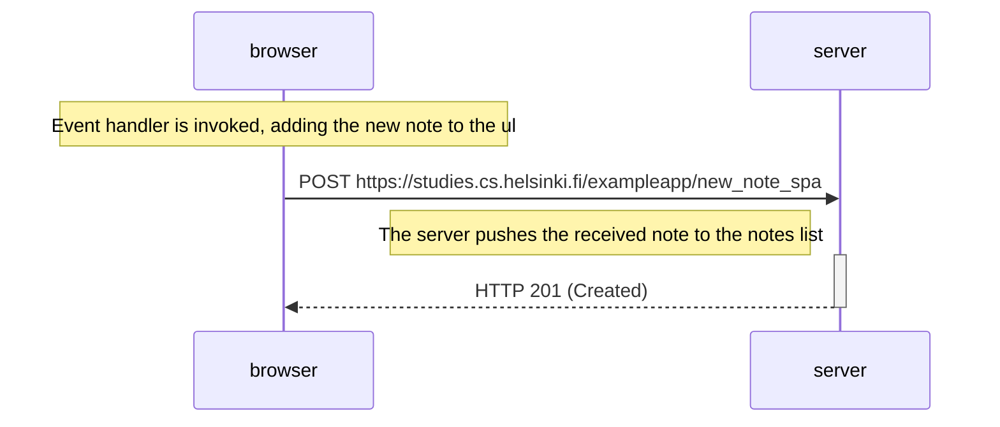

```mermaid
sequenceDiagram
    participant browser
    participant server

    Note over browser: Event handler is invoked, adding the new note to the ul

    browser->>server: POST https://studies.cs.helsinki.fi/exampleapp/new_note_spa
    Note left of server: The server pushes the received note to the notes list
    activate server
    server-->>browser: HTTP 201 (Created) 
    deactivate server
```